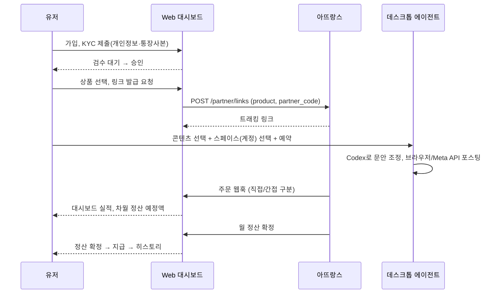

# 00. 제품 개요 및 요구사항 정의 (PRD)

## 1. 제품 정의
**automoney**는 아뜨랑스(20~30대 여성 의류 자체제작 쇼핑몰) 상품을 개인 SNS 채널에서 판매하는 **부업형 제휴 마케팅 플랫폼**입니다.

- 아뜨랑스는 상품별 마케팅 링크와 구매 실적, 월 정산 확정 데이터를 제공합니다.
- 유저는 개인별로 발급된 링크를 인스타그램·틱톡·블로그·쓰레드·X에 포스팅하고, 링크 경유 구매에 대해 수당을 받습니다.
- 콘텐츠 제작·포스팅·예약은 유저 PC의 데스크톱 에이전트가 Codex(유저 구독 계정)로 자동화하며, 텔레그램 봇과 MCP로 지시·보고합니다.

### 1.1 목표
| 목표 | 지표 |
|---|---|
| 유저가 링크 발급 후 첫 포스팅까지 10분 이내 | 온보딩 완료율, TTFP(time to first post) |
| 정산 오차 0건 | 아뜨랑스 확정 데이터 대비 원장 불일치 건수 |
| 채널별 콘텐츠 자동 생산 | 매거진 1건당 채널별 콘텐츠 5종 이상 생성, 품질 게이트 90점 이상 통과율 |
| 다계정 안정 운영 | 스페이스별 세션 만료·차단 없이 30일 연속 예약 실행 |

### 1.2 비목표 (1차 범위 외)
- 아뜨랑스 외 타 쇼핑몰 연동 (어댑터 인터페이스만 남김)
- 광고 집행(유료 광고 계정 연동)
- 유저 간 다단계 추천 보상 (총판→유저 2단계까지만)

## 2. 역할 (Actors)

```mermaid
flowchart LR
  A[아뜨랑스 전산] -->|링크 발급·주문·정산확정| S[automoney Cloud]
  SA[수퍼어드민<br/>운영사] --> S
  AD[어드민<br/>총판] --> S
  U[유저<br/>부업 마케터] --> S
  U --> D[데스크톱 에이전트<br/>유저 PC]
  D -->|포스팅| SNS[인스타·틱톡·블로그·쓰레드·X]
  D <-->|지시·보고| T[텔레그램 봇]
  M[MCP 클라이언트<br/>ChatGPT·Claude·Codex] <-->|stateless MCP| S
```

| 역할 | 설명 | 핵심 화면 |
|---|---|---|
| 유저 | 가입 → KYC(개인정보·통장사본) → 링크 발급 → 콘텐츠 선택·포스팅 → 실적·정산 확인 | 대시보드, 링크 관리, 콘텐츠 라이브러리, 정산 히스토리, 계정·스페이스 관리 |
| 어드민(총판) | 하부 유저 모집·관리, 하부 실적과 본인 차액 정산금 확인 | 총판 대시보드, 하부 유저 목록, 정산 리포트 |
| 수퍼어드민(운영사) | 전체·개별 실적, 그레이드별 아뜨랑스 지급 차액, 24h 간접구매 실적·정산금, 요율 설정, KYC 승인, 매거진·콘텐츠 운영 | 운영 대시보드, 정산 관리, 요율 규칙, KYC 검수, 콘텐츠 운영 |
| 아뜨랑스 전산 | 상품·링크·주문·정산확정 데이터 원천 | (API/웹훅, 04 문서) |

## 3. 사용자 여정

## 4. 기능 요구사항

### 4.1 회원·KYC
- 이메일/카카오 가입, 총판 초대 코드로 `parent_admin` 연결.
- KYC: 실명, 생년월일, 연락처, 주소, 주민등록번호(암호화 저장, 마스킹 표시), 은행·계좌·예금주, **통장사본 이미지 업로드**.
- KYC 미승인 상태에서도 링크 발급·포스팅은 가능하되, 정산은 `HELD`(보류)로 누적되고 승인 시 소급 지급.
- 수퍼어드민 검수 큐(승인/반려 사유), 개인정보 접근 감사로그.

### 4.2 링크
- 상품 카탈로그(아뜨랑스 동기화) 검색·즐겨찾기.
- 상품×유저 1:1 링크 발급, 단축 URL, QR, UTM 자동 부여.
- 링크별 클릭·구매·전환율 통계, 비활성화.

### 4.3 대시보드 (유저)
- 오늘/이번 달 클릭·주문·매출·**예상 수당**, 차월 정산 예정액(확정 전 추정치임을 표기).
- 주문 목록(상품, 금액, 상태: 결제/취소/반품/확정), 직접구매만 표시.
- 정산 히스토리(월별 확정액·지급일·지급 상태·명세서 PDF).

### 4.4 어드민(총판)
- 하부 유저 목록·가입 현황·KYC 상태.
- 하부 유저별 실적과 총판 차액(총판 요율 − 유저 요율) 월별 리포트.

### 4.5 수퍼어드민
- 전체·총판별·유저별 실적, 아뜨랑스 지급(그레이드별 %) 대비 운영사 차액.
- **24h 간접구매** 실적·정산금 (수퍼어드민 외 노출 금지, 03 §6 가시성 매트릭스).
- 요율 규칙 관리(그레이드·직접/간접·유효기간), 정산 확정·지급 처리, 아뜨랑스 데이터 리컨실.

### 4.6 콘텐츠 엔진 (06)
- 매거진 일일 수집 → 채널별 콘텐츠(캡션·해시태그·이미지 크롭·숏폼 스크립트) 생성 → 품질 게이트 → 라이브러리 제공.
- 큐레이션: 짤/밈, 트렌드 이슈, 제품 상세정보 팩, 연예인 동일 제품 착용 검색.

### 4.7 자동화·다계정 (05)
- 스페이스(SNS 계정 1:1 격리 브라우저 프로필), 브라우저 고정, 예약 스케줄(KST, 랜덤 지터), 계정별 일일 한도.
- AI 에이전트(Codex)가 시맨틱 스냅샷 기반으로 클릭·타이핑 수행, 발행 전 승인 게이트.

### 4.8 지시·보고 채널
- 텔레그램 봇: 작업 지시 명령, 승인 버튼, 결과·실패 보고.
- stateless MCP: 외부 AI 클라이언트에서 링크 발급·콘텐츠 생성·예약·실적 조회.

## 5. 비기능 요구사항
| 항목 | 요구 |
|---|---|
| 개인정보 | 주민번호·계좌·통장사본은 KMS 봉투 암호화, 열람 감사로그, 보관기간 정책(탈퇴 후 5년 세무 보관) |
| 정산 무결성 | 주문 원장 불변(append-only), 정산 계산 결정론적·재실행 가능, 아뜨랑스 확정 데이터와 일일 리컨실 |
| 가용성 | Cloud API 99.5%, 데스크톱 에이전트 오프라인 시 잡 보류 후 재개 |
| 보안 | OAuth PKCE, 스코프 최소권한, 데스크톱 1인 1디바이스 정책(blogautomcp `lib/pairing.ts` 계승), 시크릿 원타임 노출 |
| 플랫폼 정책 | 자동 포스팅 한도·간격 준수, 계정 차단 감지 시 자동 중지 |
| 관측성 | 잡 결과 봉투·에러 코드 택소노미, 스페이스별 스크린샷 로그 |

## 6. 용어집
| 용어 | 정의 |
|---|---|
| 마케팅 링크 | 상품×유저에 대해 아뜨랑스가 발급한 트래킹 URL |
| 직접구매 | 링크 랜딩 상품을 구매한 주문 |
| 간접구매 | 링크 클릭 후 24시간 내 다른 상품을 구매한 주문 |
| 그레이드 | 운영사가 아뜨랑스로부터 받는 지급률 등급(실적 구간별) |
| 차액 | 상위 레벨 수취율 − 하위 레벨 지급률 |
| 스페이스 | SNS 계정 하나에 대응하는 격리 브라우저 프로필과 작업 이력 단위 |
| 잡 | 클라우드가 발급하고 데스크톱 에이전트가 수행하는 작업 단위 |
