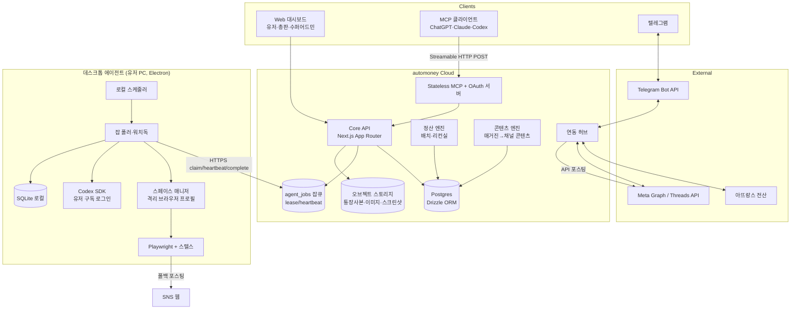
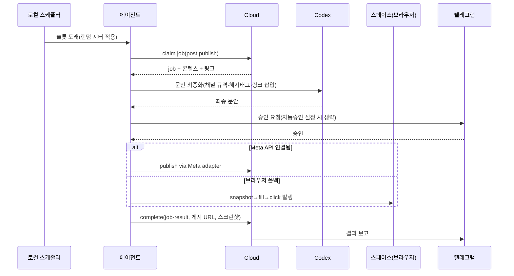
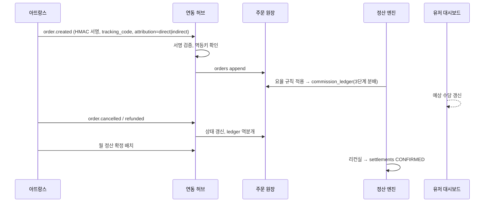

# 01. 시스템 아키텍처

> 참조: blogautomcp `docs/mcp-saas-local-agent-product-plan.md`(3-tier 구조), `apps/sites/`(stateless MCP·OAuth·잡큐), 루트 앱 `src/`·`scripts/electron/`(데스크톱 에이전트)

## 1. 전체 구조



### 1.1 티어별 책임
| 티어 | 책임 | 배포 |
|---|---|---|
| Cloud Core | 회원·KYC, 상품·링크, 주문 원장, 정산, 대시보드, 콘텐츠 라이브러리, 잡 발급 | Cloudflare Workers 또는 Node 컨테이너(정산 배치는 컨테이너 권장) |
| Stateless MCP | 외부 AI 클라이언트용 툴 노출, OAuth 인가, 툴 호출→API/잡큐 변환 | Cloud Core와 동일 배포, 세션 상태 없음 |
| Desktop Agent | 브라우저 스페이스, Codex 실행, SNS 포스팅, 로컬 예약, 텔레그램 승인 처리 | Electron(Win/mac), 자동 업데이트 |

### 1.2 왜 로컬 에이전트인가 (ADR-0001, ADR-0005)
- Codex ChatGPT 구독 OAuth 토큰은 유저 PC의 Codex CLI/SDK가 사용하는 것이 공식 경로이며, 제3자 서버가 위임 사용하는 것은 지원되지 않습니다.
- SNS 계정은 유저 개인 소유이므로 유저 IP·디바이스에서 포스팅하는 것이 계정 안전에 유리합니다.
- blogautomcp가 동일 구조로 운영 검증되었습니다(`src/app/api/remote-agent/poll/route.ts`, `scripts/electron/main.cjs`).

## 2. 컴포넌트 상세

### 2.1 Core API
- Next.js App Router, TypeScript, Drizzle ORM(Postgres). 라우트 그룹: `/api/auth`, `/api/kyc`, `/api/products`, `/api/links`, `/api/orders`, `/api/settlements`, `/api/content`, `/api/spaces`, `/api/schedules`, `/api/admin/*`, `/api/super/*`, `/api/partner/attrangs/*`(웹훅 수신), `/api/agent/jobs/*`.
- 권한: RBAC 미들웨어(`USER`/`ADMIN`/`SUPER_ADMIN`) + 행 수준 스코프(총판은 `parent_admin_id = self`인 유저만).
- 감사: 개인정보 열람·요율 변경·정산 확정은 `audit_events` 기록(blogautomcp `auditEvents` 계승).

### 2.2 잡큐 (blogautomcp `apps/sites/lib/jobs.ts` 계승)
- 상태: `QUEUED → CLAIMED → RUNNING → SUCCEEDED | FAILED | CANCELLED`, 120초 lease, 30초 heartbeat, 만료 lease 지연 회수.
- 잡 유형: `content.generate`, `post.publish`, `post.schedule`, `space.create`, `space.login_check`, `curation.fetch`, `codex.login`, `meta.token_refresh`.
- 결과 봉투 `automoney.job-result/v1`:
  ```json
  { "schema": "automoney.job-result/v1", "jobType": "post.publish", "kind": "ok|error|needs_action",
    "summary": "…", "data": {}, "readiness": {"score": 92, "publishable": true},
    "warnings": [], "nextAction": "…", "errorCode": null }
  ```
- 에러 코드: `ATTRANGS_LINK_UNAVAILABLE`, `ATTRANGS_WEBHOOK_SIGNATURE_INVALID`, `KYC_INCOMPLETE`, `META_TOKEN_EXPIRED`, `META_PERMISSION_MISSING`, `SPACE_LOCKED`, `SPACE_SESSION_EXPIRED`, `SPACE_ACCOUNT_RESTRICTED`, `CODEX_LOGIN_REQUIRED`, `CONTENT_QUALITY_BELOW_GATE`, `RATE_LIMIT_DAILY_REACHED`, `AGENT_OFFLINE`, `AGENT_LOST_UNCERTAIN`, `APP_UPDATE_REQUIRED`.

### 2.3 연동 허브
| 어댑터 | 방향 | 문서 |
|---|---|---|
| 아뜨랑스 | 상품 동기화(pull), 링크 발급(push), 주문 웹훅(in), 정산확정(pull), 매거진 피드(pull) | 04 §1 |
| Meta | OAuth 연결, Threads/Instagram 발행, 인사이트, 토큰 갱신 | 04 §2 |
| 텔레그램 | 명령 수신(webhook), 승인 콜백, 결과 전송 | 04 §4 |
| Codex | 데스크톱 로컬 로그인 상태 보고만 클라우드로 | 04 §3 |

### 2.4 데스크톱 에이전트
- Electron + 내장 Next 서버(127.0.0.1) + SQLite + Playwright(persistent context per space) + `@openai/codex-sdk`.
- 페어링: 딥링크 `automoney://pair`와 8자리 코드(blogautomcp `lib/pairing.ts`, `main.cjs` `handlePairDeepLink`). 1유저 1활성 디바이스, 재발급 시 토큰·잡 회수.
- 워치독 45초, 오프라인 시 로컬 스케줄 보류, 온라인 복귀 시 재개.
- 상세는 05 문서.

## 3. 핵심 시퀀스

### 3.1 예약 포스팅 실행


### 3.2 주문 수신 → 정산 반영


## 4. 기술 스택
| 영역 | 선택 | 근거 |
|---|---|---|
| 웹/API | Next.js(App Router) + TypeScript | blogautomcp와 동일, 코드 이식 용이 |
| DB/백엔드 | Convex (문서 DB + 서버 함수 + 파일 스토리지 + HTTP actions) | 운영 부담 최소화, 실시간 대시보드. 정산 집계는 트랜잭션 내 롤업 테이블로 유지 (ADR-0006, ADR-0002 대체) |
| MCP | Streamable HTTP, stateless, JSON-Schema 툴 정의 단일 소스 | blogautomcp `apps/sites/lib/tool-schema.ts` |
| 데스크톱 | Electron + Playwright(+stealth) + Codex SDK + SQLite | blogautomcp 루트 앱 |
| 스토리지 | S3 호환(R2) | 통장사본·이미지·스크린샷 |
| 배치 | Cloud 컨테이너 cron(정산·리컨실·매거진 수집) | 서버리스 lease 회수 방식 한계 보완 |
| 알림 | Telegram Bot API | blogautomcp `scripts/lib/chatbot-notifier.ts` 확장 |
| 테스트 | `verify-*` 계약 스크립트 + Vitest 단위 테스트 | blogautomcp 방식 유지, 정산 계산은 단위 테스트 필수 |

## 5. blogautomcp 재사용 모듈 맵
| automoney 컴포넌트 | blogautomcp 원본 | 변경 |
|---|---|---|
| MCP 서버·툴 스키마 | `apps/sites/app/api/mcp/[credential]/route.ts`, `lib/tool-schema.ts`, `lib/mcp.ts` | 툴 카탈로그 교체(04 §5) |
| OAuth(PKCE, DCR, well-known) | `apps/sites/lib/oauth.ts`, `app/oauth/*`, `app/[...wellKnown]` | 스코프 확장(`admin:*`) |
| 잡큐 | `apps/sites/lib/jobs.ts`, `app/api/agent/jobs/*` | Postgres 이식, 잡 유형 확장 |
| 디바이스 페어링 | `apps/sites/lib/pairing.ts`, `lib/device.ts` | 프로토콜명 변경 |
| 에이전트 폴러 | `src/app/api/remote-agent/poll/route.ts`, `main.cjs` 워치독 | 잡 디스패처 테이블 교체 |
| Codex 로그인 | `src/lib/codex-local.ts`, `src/app/api/codex/route.ts`, `scripts/lib/codex-draft-provider.ts` | 그대로 |
| 스케줄러 | `src/services/scheduler.ts`, `src/lib/scheduler/random-schedule.ts`, `src/lib/kst.ts` | 스페이스·계정 한도 차원 추가 |
| 브라우저 프로필 락 | `scripts/lib/chatgpt-profile-lock.ts` | 스페이스 단위 락으로 일반화 |
| 세션 검증 | `src/lib/naver-session.ts`(storageState) | 플랫폼별 세션 검증기 |
| 텔레그램 | `scripts/lib/chatbot-notifier.ts` | 단방향 알림 → 양방향 봇 |
| 품질 게이트 | `src/lib/topic-task-content-readiness.ts`, `scripts/lib/draft-quality-signals.ts`, `humanize-korean.ts` | 채널별 규격 추가 |
| 이미지 처리 | `scripts/lib/image-*.ts`, `sharp` | 채널별 비율 크롭 |
| 로컬 API 인증 | `src/lib/api-auth.ts`, `admin-session.ts` | 그대로 |
| 자동 업데이트 | `scripts/electron/auto-update.cjs` | 그대로 |

재사용하지 않는 것: `apps/site`(레거시), 네이버 에디터 자동화(`naver-*`), SQLite JSON-in-TEXT 데이터 모델.
