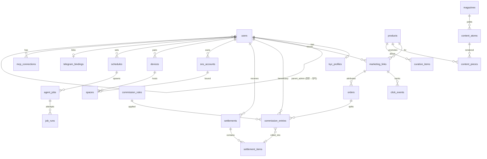

# 02. 데이터 모델

> **2026-09-04 갱신**: 백엔드는 Convex 로 확정되었습니다(ADR-0006). 물리 스키마의 정본은 `apps/web/convex/schema.ts` 이며, 아래 표는 컬럼 계약(필드·의미·인덱스)으로 유지합니다. M1 에 구현된 테이블: users, inviteCodes, kycProfiles, products, marketingLinks, clickEvents, orders, orderEvents, userMonthlyStats(월 집계), settings, auditEvents. 데스크톱 에이전트(M3)는 SQLite 로컬 캐시를 사용합니다.

## 1. ERD (핵심)

## 2. 테이블 정의

### 2.1 회원·권한
**users**
| 컬럼 | 타입 | 비고 |
|---|---|---|
| id | uuid PK | |
| email | text unique | |
| role | enum `USER, ADMIN, SUPER_ADMIN` | |
| parent_admin_id | uuid FK users | 유저의 소속 총판, 총판은 null |
| status | enum `PENDING, ACTIVE, SUSPENDED, WITHDRAWN` | |
| grade_override | text null | 유저 개별 요율 예외 |
| created_at, updated_at | timestamptz | |

**kyc_profiles**
| 컬럼 | 타입 | 비고 |
|---|---|---|
| user_id | uuid PK FK | |
| legal_name, phone, address | text | |
| birth_date | date | |
| resident_no_enc | bytea | KMS 봉투 암호화 |
| resident_no_last4 | text | 표시용 |
| bank_code, account_no_enc, account_holder | | 계좌 암호화 |
| bankbook_object_key | text | 통장사본 스토리지 키 |
| status | enum `SUBMITTED, APPROVED, REJECTED` | |
| reviewed_by, reviewed_at, reject_reason | | |

### 2.2 상품·링크·추적
**products**: `id`, `attrangs_product_id`(unique, 사이트의 `index_no`), `name`, `price`, `sale_price`, `category`, `image_urls jsonb`, `detail_url`, `status`, `synced_at`.

**marketing_links**: `id`, `user_id`, `product_id`, `tracking_code`(unique, 아뜨랑스 발급), `target_url`, `short_code`(unique), `utm jsonb`, `status`, `issued_at`. 유니크 `(user_id, product_id)`.

**click_events**: `id`, `link_id`, `clicked_at`, `ip_hash`, `ua_hash`, `referrer_domain`, `channel`(추정: instagram/threads/x/tiktok/blog). 90일 보관.

### 2.3 주문 원장·정산
**orders** (append-only, 상태 변경은 `order_events`로)
| 컬럼 | 비고 |
|---|---|
| id, attrangs_order_id unique | |
| link_id, user_id | 어트리뷰션 결과 |
| attribution | enum `DIRECT, INDIRECT` |
| clicked_at, ordered_at | 24h 판정 근거 |
| product_id, quantity, order_amount, commissionable_amount | 배송비·할인 제외 금액 |
| status | `PAID, CANCELLED, REFUNDED, CONFIRMED` (아뜨랑스 확정 후 CONFIRMED) |
| raw_payload jsonb, received_at, idempotency_key unique | |

**order_events**: `order_id`, `event_type`, `payload`, `occurred_at`.

**commission_rules**
| 컬럼 | 비고 |
|---|---|
| id, name | |
| level | enum `ATTRANGS_TO_OPERATOR, OPERATOR_TO_ADMIN, ADMIN_TO_USER` |
| attribution | `DIRECT, INDIRECT, ANY` |
| grade | text null (`ATTRANGS_TO_OPERATOR`용: 예 G1~G4) |
| rate_bps | int (basis points) |
| valid_from, valid_to | |
| scope_user_id / scope_admin_id | 개별 예외 |

**commission_entries** (주문별 3단계 분배 결과, 결정론적 재계산 가능)
| 컬럼 | 비고 |
|---|---|
| id, order_id | |
| beneficiary_type | `OPERATOR, ADMIN, USER` |
| beneficiary_user_id | OPERATOR는 null |
| rule_id, rate_bps, base_amount, amount | |
| sign | +1 / −1(취소·반품 역분개) |
| settlement_item_id | null이면 미정산 |
| computed_at, computation_version | 규칙 변경 추적 |

**settlements**: `id`, `beneficiary_user_id`(운영사는 null), `period_month`(YYYY-MM), `status` `DRAFT, CONFIRMED, APPROVED, PAID, HELD`, `gross_amount`, `withholding_tax`(3.3%), `net_amount`, `held_reason`, `paid_at`, `statement_object_key`.

**settlement_items**: `settlement_id`, `commission_entry_id`, `amount`.

**attrangs_settlement_batches**: 아뜨랑스 확정 데이터 원본 (`period_month`, `grade`, `payout_total`, `order_count`, `raw`, `reconciled_at`, `diff_amount`).

### 2.4 SNS 계정·디바이스·스페이스
**sns_accounts**: `id`, `user_id`, `platform` `INSTAGRAM, THREADS, X, TIKTOK, NAVER_BLOG, TISTORY`, `handle`, `auth_mode` `META_API, BROWSER`, `meta_token_enc`, `meta_token_expires_at`, `daily_post_limit`, `status`.

**devices**: `id`, `user_id`, `name`, `platform`, `app_version`, `paired_at`, `last_seen_at`, `revoked_at`. 유저당 활성 1개.

**spaces**: `id`, `device_id`, `sns_account_id` unique, `name`, `profile_dir`(로컬 경로, 클라우드는 메타만), `pinned`(bool), `fingerprint jsonb`(UA·타임존·뷰포트·언어), `lock_owner`, `lock_expires_at`, `session_state` `HEALTHY, EXPIRED, RESTRICTED`, `last_checked_at`.

**space_activity_logs**: `space_id`, `job_run_id`, `action`, `screenshot_key`, `at`.

### 2.5 자동화
**schedules**: `id`, `user_id`, `space_id`, `kind` `ONE_SHOT, DAILY, WEEKLY, CRON`, `cron_expr`, `jitter_minutes`, `content_source` `LIBRARY_PICK, AUTO_GENERATE`, `product_filter jsonb`, `auto_approve`(bool), `enabled`, `next_run_at`.

**agent_jobs**: blogautomcp 스키마 계승 + `space_id`, `schedule_id`, `job_type`, `payload jsonb`, `idempotency_key`, `lease_expires_at`, `heartbeat_at`, `result jsonb`, `error_code`.

**job_runs**: `job_id`, `attempt`, `started_at`, `finished_at`, `status`, `log_object_key`.

### 2.6 콘텐츠
**magazines**: `id`, `attrangs_magazine_id`, `title`, `body_html`, `hero_image`, `product_ids int[]`, `published_at`, `ingested_at`.

**content_atoms**: `id`, `magazine_id`, `atom_type` `HOOK, STYLE_TIP, PRODUCT_POINT, QUOTE, TREND_TIE_IN`, `text`, `product_id`, `rank`.

**content_pieces**: `id`, `atom_id`, `product_id`, `channel` `INSTAGRAM_FEED, INSTAGRAM_REEL, THREADS, X, TIKTOK, BLOG`, `caption`, `hashtags text[]`, `media jsonb`(크롭 규격별 이미지 키), `script`(숏폼), `quality_score`, `quality_report jsonb`, `status` `DRAFT, APPROVED, RETIRED`, `usage_count`.

**curation_items**: `id`, `product_id`, `kind` `MEME, TREND, PRODUCT_FACT, CELEB_MATCH`, `title`, `source_url`, `media_key`, `license_note`, `score`, `expires_at`.

**content_usages**: `piece_id`, `user_id`, `space_id`, `job_id`, `posted_url`, `posted_at`. (성과 루프용)

### 2.7 채널·연결
**telegram_bindings**: `user_id` PK, `chat_id`, `bind_code`, `bound_at`, `notify_prefs jsonb`.

**mcp_connections / oauth_clients / oauth_authorization_codes / oauth_tokens / pair_codes / rate_limits / audit_events**: blogautomcp `apps/sites/db/schema.ts` 계승.

## 3. 데스크톱 SQLite (로컬)
| 테이블 | 용도 |
|---|---|
| local_spaces | 스페이스 id ↔ 프로필 디렉터리, 락 파일 경로 |
| local_jobs | 클레임한 잡 캐시, 오프라인 재개 |
| local_schedule_slots | 다음 실행 슬롯(지터 계산 결과) |
| local_logs | 액션 로그·스크린샷 경로 |
| settings | key/value (blogautomcp `Setting` 계승) |
| codex_auth_status | 로그인 여부·만료 (토큰 자체는 `~/.codex/auth.json`, DB 미저장) |

## 4. 인덱스·보관 정책
- `orders(user_id, ordered_at)`, `orders(attribution, ordered_at)`, `commission_entries(beneficiary_user_id, settlement_item_id)`, `click_events(link_id, clicked_at)`.
- `click_events` 90일, `space_activity_logs` 180일, 개인정보는 탈퇴 후 5년(세무) 뒤 파기.
