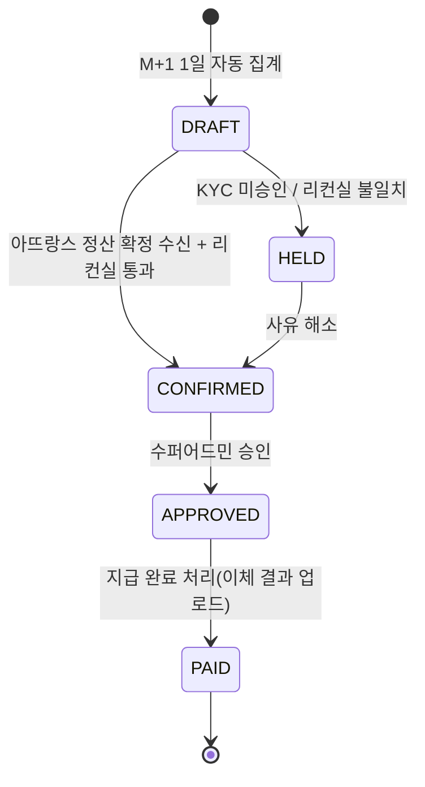

# 03. 링크 추적 · 어트리뷰션 · 정산

## 1. 링크와 추적
- 링크 발급: 유저가 상품 선택 → Cloud가 아뜨랑스 `POST /partner/links`로 `partner_code`(유저 고유)·`product_id` 전달 → `tracking_code` 수신 → 단축 URL(`https://amny.kr/{short_code}`) 생성.
- 클릭 경로: 단축 URL → automoney 리다이렉터(클릭 로그, 채널 추정) → 아뜨랑스 상품 페이지(`?am_tc={tracking_code}`).
- 아뜨랑스 측 책임: 랜딩 시 `am_tc`를 24시간 쿠키로 보관, 주문 생성 시 쿠키의 tracking_code와 랜딩 상품 일치 여부로 `DIRECT`/`INDIRECT` 판정 후 웹훅 전송.

## 2. 3단계 마진 구조


| 레벨 | 수취 | 차액(수익) | 가시 주체 |
|---|---|---|---|
| 운영사 | 매출 × R_a(그레이드) | 매출 × (R_a − R_m) | 수퍼어드민만 |
| 총판 | 매출 × R_m | 매출 × (R_m − R_u) | 총판 본인, 수퍼어드민 |
| 유저 | 매출 × R_u | 매출 × R_u | 유저 본인, 소속 총판, 수퍼어드민 |

- 총판 없는 직속 유저: R_m 단계 생략, 운영사 차액 = R_a − R_u.
- **간접구매**(24h): 별도 요율표 `R_a', R_m', R_u'`. **확정 정책(2026-09-04): 유저 간접 요율 0bps** — 간접구매 수익은 운영사·총판만 가져갑니다(요율표에서 변경 가능). 간접구매 **집계·금액은 수퍼어드민 전용** 화면에만 노출되며, 총판에게는 차액 총액에만 합산됩니다(요구사항 7).
- 그레이드: 아뜨랑스가 운영사 월 매출 구간별로 R_a를 차등 지급. 그레이드 확정은 월 마감 후이므로, 월중 대시보드의 운영사 차액은 "현재 그레이드 기준 추정"으로 표기하고 확정 시 재계산.

### 2.1 계산 규칙 (결정론적)
```
base = commissionable_amount (배송비·쿠폰 제외, 아뜨랑스 웹훅 값)
user_amt     = floor(base × R_u / 10000)
admin_amt    = floor(base × R_m / 10000) − user_amt
operator_amt = floor(base × R_a / 10000) − user_amt − admin_amt
```
- 요율은 basis points(만분율) 정수, 원 단위 내림. 반올림 차액은 운영사에 귀속.
- 규칙 선택: 주문 `ordered_at` 시점에 유효한 `commission_rules`(개별 예외 > 총판 예외 > 전역).
- 취소·반품: 동일 금액 `sign = −1` 역분개 항목 추가. 이미 지급된 정산에 속하면 다음 달 정산에서 차감.
- `computation_version`을 저장해 규칙 개정 후에도 과거 계산을 재현.

## 3. 정산 사이클 (월 단위)



| 시점 | 처리 |
|---|---|
| 매일 | 웹훅 수신, `commission_entries` 생성, 유저 대시보드 "예상 수당" 갱신 |
| M+1 1일 | 전월 `orders` 중 확정 대상 집계 → 수혜자별 `settlements(DRAFT)` |
| 아뜨랑스 확정 시(M+1 ~10일 가정) | `GET /partner/settlements?month=` 수신 → 주문 단위 매칭, 금액 차이 `diff_amount` 기록 |
| 리컨실 통과 | `CONFIRMED`. 웹 명세서(인쇄/PDF 저장) 열람 가능 |
| 수퍼어드민 승인 | `APPROVED`, 아뜨랑스 전달용 지급 파일(수령인·계좌·금액 CSV) 생성(감사로그) |
| 지급 | 아뜨랑스가 지급·원천징수 수행 → 수퍼어드민이 지급 참조번호와 함께 `PAID` 처리, 유저 히스토리 반영 |

구현 메모(M2): 수수료 원장 `commissionEntries` 는 주문별 "원하는 분배 − 이미 정산된 금액" 의 델타 항목만 미정산으로 남기므로, 취소·요율 변경·그레이드 확정이 모두 같은 재계산 경로(`recomputeMonth`)를 탄다. 월 마감(`closeMonth`)은 DRAFT/HELD 를 매번 재구성(멱등)하고 CONFIRMED 이상은 불변이다.

## 4. 대시보드 지표 정의
| 지표 | 정의 | 유저 | 총판 | 수퍼어드민 |
|---|---|---|---|---|
| 클릭 | `click_events` 수 | 본인 | 하부 합계·개별 | 전체 |
| 주문·매출(직접) | `orders.attribution=DIRECT`, 취소 제외 | 본인 | 하부 | 전체 |
| 주문·매출(간접) | `attribution=INDIRECT` | ✗ | ✗ | ✓ |
| 예상 수당 | 미정산 `commission_entries` 합(본인 수혜) | ✓ | 본인 차액 | 전체 레벨별 |
| 차월 정산 예정액 | 전월분 DRAFT/CONFIRMED 합 | ✓ | ✓ | ✓ |
| 운영사 차액 | operator_amt 합, 그레이드 반영 | ✗ | ✗ | ✓ |
| 총판 차액 | admin_amt 합 | ✗ | 본인 | ✓ |
| 정산 히스토리 | `settlements` 월별 상태·금액·지급일 | ✓ | ✓ | ✓ |

## 5. KYC와 지급 조건
- KYC `APPROVED`가 아니면 정산은 `HELD(KYC_INCOMPLETE)`. 링크·포스팅·실적 조회는 허용(요구사항 4: "수당을 인정받아 받을 수 있다"는 지급 조건으로 해석).
- HELD 인 동안 수수료 항목은 정산에 묶이지 않고 남아 있다가, 승인 후 다음 마감에서 자동 합산된다.
- **세금(확정 2026-09-04)**: 원천징수와 실제 지급은 아뜨랑스가 수행한다. automoney 는 세전 금액만 계산·표시하고 세금을 공제하지 않는다.

## 6. 가시성 매트릭스 (권한 강제)
| 데이터 | 유저 | 총판 | 수퍼어드민 |
|---|---|---|---|
| 본인 직접 실적·수당 | ✓ | 하부만 | ✓ |
| 타 유저 개인정보 | ✗ | 마스킹(이름·연락처 일부) | ✓(감사로그) |
| 요율 R_u | 본인 것 | 하부 것 | ✓ |
| 요율 R_m, 총판 차액 | ✗ | 본인 것 | ✓ |
| 요율 R_a, 그레이드, 운영사 차액 | ✗ | ✗ | ✓ |
| 간접구매 실적·금액 | ✗ | ✗ | ✓ |
| 아뜨랑스 확정 배치 원본 | ✗ | ✗ | ✓ |

구현: API 레벨에서 필드 화이트리스트 응답 스키마를 역할별로 분리(`UserOrderView`, `AdminOrderView`, `SuperOrderView`). 간접구매 행은 유저·총판 쿼리에서 WHERE 절로 제외.

## 7. 리컨실 규칙
- 매칭 키: `attrangs_order_id`. 금액 차이 허용 오차 0원.
- 아뜨랑스에만 있는 주문: 원장에 `SOURCE=RECON` 으로 추가 후 어트리뷰션 재시도. automoney에만 있는 주문: `HELD` 사유로 표기, 아뜨랑스에 조회.
- 그레이드 불일치: 아뜨랑스 배치의 `grade`를 정본으로 재계산.
