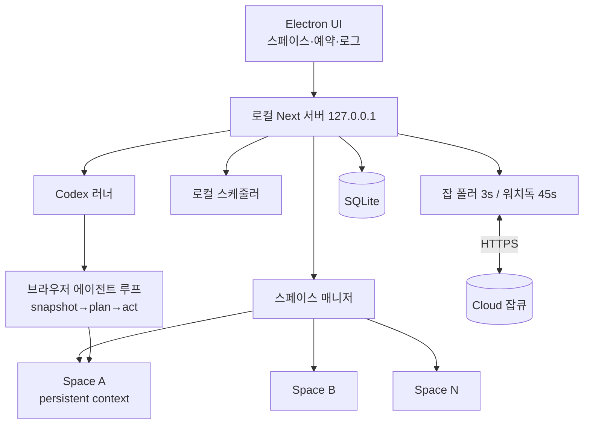
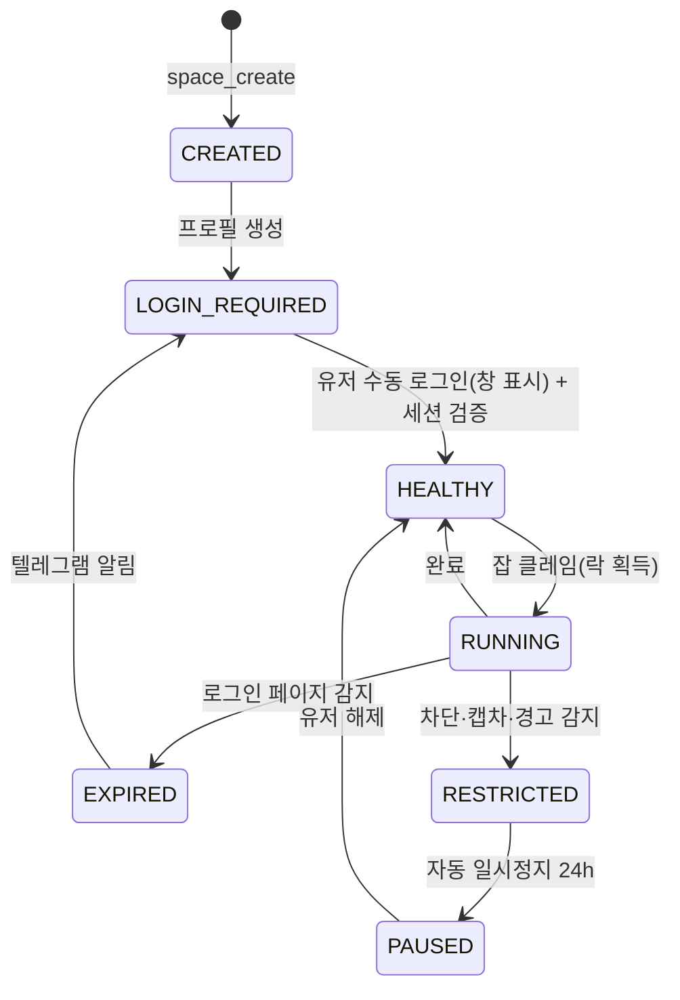

# 05. 데스크톱 에이전트 · 브라우저 스페이스 · 다계정 자동화

> 참조: ego lite(계정별 격리 Space, 병렬 에이전트, 시맨틱 스냅샷 + snapshot/fill/click/wait/navigate/capture 액션). ego lite는 macOS 전용 오픈소스이므로 개념을 차용하고 Playwright로 구현합니다. blogautomcp `scripts/lib/chatgpt-profile-lock.ts`, `src/lib/naver-session.ts`, `src/services/scheduler.ts` 계승.

## 1. 데스크톱 에이전트 구성

- 설치·페어링: 설치 후 대시보드 "디바이스 연결" → 딥링크 `automoney://pair?code=` 또는 8자리 코드. 1유저 1활성 디바이스.
- 자동 시작·트레이 상주, 유휴 시 자동 업데이트(진행 중 잡 0건일 때만).

## 2. 스페이스 (Space)

### 2.1 정의
스페이스는 **SNS 계정 1개에 1:1로 대응하는 격리 실행 단위**입니다. 다음이 스페이스별로 분리 보관됩니다.
- 브라우저 프로필 디렉터리(쿠키, 로컬스토리지, 캐시, 확장), Playwright `launchPersistentContext`.
- 브라우저 지문(UA, 언어, 타임존, 뷰포트, WebGL 노이즈 시드) — 생성 시 고정, 이후 불변.
- 세션 상태(`HEALTHY / EXPIRED / RESTRICTED`)와 마지막 검증 시각.
- 작업 이력(액션 로그, 스크린샷, 게시 URL), 실패 이력.
- 락(`lock_owner`, `lock_expires_at`): 동시에 하나의 잡만 실행.

### 2.2 라이프사이클

- 최초 로그인은 항상 사람이 수행(창 표시, 2FA 포함). 자동화는 세션 유지·검증만 담당.
- 세션 검증기: 플랫폼별 "로그인됨" 신호 셀렉터(blogautomcp `naver-session.ts`의 storageState 검증 패턴 일반화).

### 2.3 스페이스 매니저 API (로컬)
| 엔드포인트 | 설명 |
|---|---|
| `POST /api/spaces` | 생성(플랫폼, 이름, 지문 시드) |
| `POST /api/spaces/{id}/open` | 사용자용 창 열기(수동 로그인) |
| `POST /api/spaces/{id}/verify` | 세션 검증 |
| `POST /api/spaces/{id}/pin` | 고정(§3) |
| `GET /api/spaces/{id}/history` | 작업 이력·스크린샷 |
| `POST /api/spaces/{id}/lock` / `unlock` | 잡 실행 락 |

## 3. 브라우저 고정 (Pin)
다계정 운영에서 계정과 브라우저 환경을 영구 결합하는 기능입니다.
- **고정 항목**: 프로필 디렉터리, 지문, 프록시(옵션, 스페이스별 고정 IP), 창 위치·크기, 계정 핸들.
- **고정 효과**: 다른 스페이스·다른 계정으로 로그인 시도 차단(핸들 불일치 감지 시 잡 중단), 지문·프록시 변경 금지, 프로필 삭제 시 이중 확인.
- **격리 보장**: 스페이스 간 쿠키·스토리지 공유 없음, 동시 실행 시 별도 프로세스, 다운로드 디렉터리 분리.
- **사용자 간섭 차단**: 잡 실행 중 스페이스 창은 별도 데스크톱 영역(최소화 또는 오프스크린)에서 동작하며 사용자의 기본 브라우저와 무관(ego lite의 "방해 없이 백그라운드" 개념).

## 4. AI 에이전트 조작 (Codex)
- 루프: `snapshot`(접근성 트리 기반 시맨틱 스냅샷, 요소 ref 부여) → Codex가 다음 액션 계획 → `click(ref)` / `fill(ref, text)` / `type(ref, text, humanDelay)` / `press(key)` / `navigate(url)` / `wait(condition)` / `capture()` → 검증 → 반복. 최대 스텝·시간 제한.
- 플랫폼별 **레시피** 우선: 안정적인 플로우(인스타 피드 업로드, 쓰레드 작성, X 작성, 틱톡 업로드, 블로그 에디터)는 셀렉터 기반 스크립트로 먼저 시도하고, 실패 시 Codex 에이전트 루프로 복구. 레시피는 버전 관리·원격 업데이트(플랫폼 UI 변경 대응).
- 인간형 입력: 타이핑 지연, 마우스 이동 경로, 스크롤, 랜덤 대기(blogautomcp `random-schedule.ts` 지터 정책 확장).
- 안전 게이트: "게시/발행" 클릭 직전 스크린샷을 승인 카드(텔레그램/UI)로 전송, `auto_approve` 스케줄만 생략. 계정 설정 변경·삭제 액션은 금지 목록.
- 모든 스텝은 스페이스 이력에 기록(액션, ref, 스크린샷).

## 5. 다계정 · 예약 자동화
- 스케줄 종류: 1회, 매일, 요일별, cron. 시간대 KST, ±지터(기본 15분), 계정별 일일 한도·최소 간격(기본 인스타 3회/일, 쓰레드 5회/일, X 5회/일, 틱톡 2회/일, 블로그 1회/일 — 수퍼어드민 조정).
- 콘텐츠 소스: 라이브러리에서 유저가 미리 담아둔 큐(선입선출) 또는 자동 생성(오늘 매거진 + 유저 즐겨찾기 상품 기준).
- 동시성: 디바이스당 동시 스페이스 실행 수 상한(기본 2), 스페이스별 락.
- 오프라인: 슬롯 도래 시 에이전트 오프라인이면 잡은 `QUEUED` 유지, 복귀 후 유효 창(기본 2시간) 내면 실행, 초과 시 스킵·보고.
- 결과 루프: 게시 URL·시각을 `content_usages`에 기록 → 성과 수집(Meta 인사이트 또는 스페이스에서 지표 스크랩) → 06 §5 분석 루프.

## 6. 보안·정책
- 프로필 디렉터리는 OS 사용자 권한으로만 접근, 클라우드에는 쿠키·비밀번호를 전송하지 않음.
- 플랫폼 이용약관 위반 소지가 있는 행위(대량 팔로우, 스팸 DM)는 기능에서 제외. 포스팅 자동화도 한도·간격 정책을 강제.
- 계정 차단 감지 시 해당 스페이스 즉시 `PAUSED`, 동일 디바이스의 다른 스페이스는 계속.
