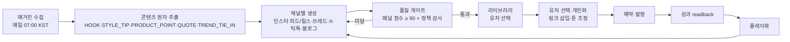

# 06. 콘텐츠 엔진 · 큐레이션

> 참조: ai-marketing-skills `content-ops/scripts/content-transform.py`(원자→채널 변환 `PLATFORM_MAP`), `content-ops/SKILL.md`(전문가 패널 90점 게이트, 휴머나이저 1.5x), `content-ops/experts/instagram.md`, `seo-ops/trend_scout.py`(트렌드 수집), `growth-engine`(실험 원장), `closed-loop-analytics-upgrade`(readback 필드), `short-form-pipeline/scripts/clip_sender.py`(승인 큐). blogautomcp `humanize-korean.ts`, `draft-quality-signals.ts`, `image-*.ts`.

## 1. 파이프라인

## 2. 채널별 생성 규격
| 채널 | 산출물 | 규격 |
|---|---|---|
| Instagram 피드 | 캡션(≤2,200자, 첫 125자 훅), 해시태그 10~20, 이미지 1:1 또는 4:5 캐러셀 최대 10장 | 링크는 프로필/스토리 안내 문구, 첫 댓글용 링크 텍스트 별도 |
| Instagram 릴스 | 15~30초 스크립트(훅·전개·CTA), 자막 텍스트, 커버 이미지 9:16 | 제품 컷 슬라이드쇼 템플릿 |
| Threads | 본문 ≤500자, 이미지 최대 10장, 스레드 연결 2~3개 | 링크 첨부 가능 |
| X | 본문 ≤280자(프리미엄 장문 옵션), 이미지 4장, 스레드 | 링크 카드 미리보기 |
| TikTok | 15~60초 스크립트, 캡션 ≤2,200자, 해시태그 3~5, 9:16 | 프로필 링크 안내 |
| 블로그(네이버·티스토리) | 제목, 본문 1,500~3,000자, 섹션 이미지 5장 이상, SEO 키워드 | blogautomcp 작성 계약 재사용 |

- 생성은 Codex(데스크톱) 또는 Cloud LLM(운영사 키, 공용 라이브러리용) 두 경로. 공용 라이브러리는 Cloud에서 매일 생성, 개인화는 유저 Codex로 수행.
- 이미지: 아뜨랑스 상품 이미지를 채널 비율로 크롭·여백·텍스트 오버레이(`sharp`), 매거진 이미지 사용 허용 범위는 아뜨랑스와 합의.

## 3. 품질 게이트
- 전문가 패널 점수(0~100): 훅 강도, 채널 적합성, 제품 정보 정확성, 톤(20~30대 여성, 존댓말/반말 옵션), AI 티 제거(휴머나이저 1.5x 가중), CTA 명확성. 90 미만은 최대 3회 재생성.
- 정책 검사(실패 시 차단): 근거 없는 최저가·1위·직접 착용 주장 금지(blogautomcp `product-photo-thumbnail-copywriting` 금칙어 계승), 가격은 카탈로그 값만, 표시광고법상 "광고/협찬" 표기 자동 삽입, 플랫폼 금칙어.
- 거절 패턴 학습: 유저·운영자가 반려한 사유를 `rejection_patterns`에 축적해 사전 감점(content-ops `patterns.md` 방식).

## 4. 큐레이션 서비스 (제품 링크만 쓰는 유저용)
| 종류 | 소스 | 산출 | 주기 |
|---|---|---|---|
| 짤/밈 | 라이선스 확인된 밈 템플릿 + 상품 컷 합성, 트렌드 밈 포맷 감지 | 이미지 + 짧은 카피 | 매일 |
| 트렌드 이슈 | 네이버 데이터랩·구글 트렌드 RSS·X·틱톡 해시태그(`trend_scout.py` 소스 확장, 한국어 소스 추가) | 이슈 카드 + 상품 연결 제안 | 6시간 |
| 제품 정보 팩 | 아뜨랑스 상세 페이지(소재·핏·사이즈·세탁), 리뷰 요약 | 핵심 포인트 5개, FAQ | 상품 동기화 시 |
| 연예인 동일 제품 착용 | 이미지 유사도 검색 + 웹 검색("○○ 착용", "공항패션") → Codex 검증 | 착용 사례 카드(출처 URL, 저작권 라벨: 링크만/인용 가능) | 매일 |
| 코디 제안 | 매거진 테마룩(하객룩·오피스·데이트) + 상품 조합 | 코디 세트 카드 | 매거진 발행 시 |

- 연예인·타인 이미지는 원본 재게시 대신 출처 링크와 텍스트 인용을 기본으로 하고, 이미지 사용은 `license_note`가 허용인 경우만. 초상권·저작권 경고 문구 표시.
- 라이브러리 UI: 상품별 탭(콘텐츠/짤/트렌드/정보/연예인), 즐겨찾기, "이 콘텐츠로 예약" 버튼.

## 5. 분석 루프
- readback 필드(게시 후 24h/72h/7d): 노출, 도달, 좋아요, 저장, 댓글, 링크 클릭, 주문, 매출, 채널, 훅 유형, CTA 유형, 게시 시간대.
- 실험 원장: 계정×채널을 "에이전트"로 두고 변형(훅·CTA·시간대)을 기록, 표본 충족 시 승자 승격(growth-engine 규칙: 유의성 + 15% 이상 개선).
- 플레이북: 승격된 패턴을 채널별 생성 프롬프트에 주입. 유저별 개인 플레이북과 전체 플레이북 분리.

## 6. 운영 화면
- 수퍼어드민: 매거진 수집 상태, 채널별 생성 건수·통과율, 반려 사유 통계, 큐레이션 소스 상태, 금칙어 관리.
- 유저: 오늘의 추천(매거진 기반 3개), 라이브러리 검색, 내 큐, 게시 성과.

## 7. 구현 메모 (M4, 2026-09-05)
- **생성 위치**: 운영사 LLM 키 없음(사용자 확정). 클라우드는 수집·원자 추출·품질 게이트·라이브러리·큐레이션 저장만 담당하고, 생성은 잡 `content.generate` 로 유저 PC 의 에이전트가 `codex exec` 로 수행한다(ADR-0005 와 동일한 토큰 경계). Codex 가 없으면 규칙 템플릿으로 폴백하고 `generatedBy=template` 로 표시한다. §3 의 "전문가 패널 점수·3회 재생성" 은 규칙 기반 `evaluatePiece` 점수(길이·해시태그·광고 표기·금칙·AI 상투어 감점)로 1차 대체했다.
- **매거진 수집**: 수퍼어드민이 URL 을 등록하면 서버가 HTML 을 가져와 `extractMagazine` 으로 추출한다(라이브러리 없이 정규식: og 메타, article/main/body 본문, 이미지, `index_no` 상품 링크 ↔ `products` 매칭). URL 접근이 막힌 경우 HTML 붙여넣기.
- **큐레이션 소스**: 트렌드 = 구글 트렌드 KR RSS(6시간 크론). 연예인 착용 = `SearchProvider`(Brave/SerpAPI 키 있을 때만, 없으면 `none`) — 출처 링크·스니펫만 저장, 이미지 재게시 금지 라벨 고정. 짤/밈 은 수퍼어드민 수동 등록(라이선스 메모 필수). 제품 정보 팩 은 카탈로그 필드 규칙 생성(상세 페이지 크롤링은 아뜨랑스 규격 합의 후).
- **코디 제안 카드**: 매거진 등록 시 규칙으로 생성한다. 제목·본문에서 테마(`detectThemes`: 하객룩·오피스룩·데이트룩·여행룩·캠퍼스룩, 없으면 데일리룩)를 감지하고, 매칭된 상품을 역할(`outfitRole`: 원피스·상의·하의·아우터·신발·가방·액세서리)로 나눠 원피스 중심(원피스+아우터+가방/신발)과 상하의 중심(상의+하의+아우터) 조합을 만든다(`buildOutfitSets`). 카드 본문에는 구성 상품·세일가·합계, 매거진에서 뽑은 스타일 팁, 테마별 주의사항이 들어간다. 저장은 큐레이션 `OUTFIT` 종류(`dedupeKey=outfit:{magazineId}:{상품조합}`)라 재등록 시 갱신만 되고, 화면은 `/dashboard/content` 의 "코디 제안" 탭과 MCP `curation_fetch(kind=OUTFIT)` 로 노출된다. 이미지는 매거진 대표 이미지만 참조하고 상품은 링크로만 연결한다.

## 8. 분석 루프 구현 메모 (M5, 2026-09-05)
- `postMetrics`(게시물 1행, 스냅샷 24h/72h/7d) — 생성 시 훅(`classifyHook`: 질문/숫자/대비/트렌드/가격/서술)·CTA(`classifyCta`: 링크/프로필/저장/댓글/없음)·KST 시간대 버킷을 규칙으로 분류한다. 스냅샷 소스: `META_API`(insights), `BROWSER`(데스크톱 `post.readback`), `LEDGER`(원장만). 클릭·주문·매출은 항상 원장에서 창 경계(게시+24h/72h/7d)까지로 결합한다.
- 실험 원장 `experiments`: 계정(USER)·전역(GLOBAL) × 채널 × 차원(HOOK/CTA/HOUR) × 변형. 7d 확정 시 누적하고 `evaluateLift`(게시물당 클릭+반응×0.1, 변형 vs 나머지, 표본≥`ANALYTICS_MIN_SAMPLES`(20)·+15%·z≥1.96)로 승격 → `playbooks` 규칙. 승격 규칙은 `content.requestGenerate` 페이로드 `playbook` 으로, 거절 사유 상위 3개는 `avoid` 로 프롬프트에 주입된다(§3 거절 패턴 학습 1차 구현).
- readback 필드 중 노출·도달·저장은 API 계정에서만 채워지고, 브라우저 스크랩은 좋아요·댓글·공유·조회 위주다(플랫폼별 셀렉터 후보는 `apps/desktop/src/agent/recipes/readback.ts`).
