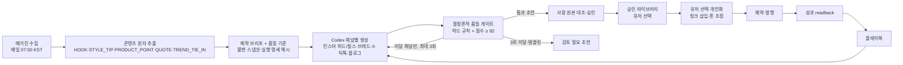

# 06. 콘텐츠 엔진 · 큐레이션

> 참조: ai-marketing-skills `content-ops/scripts/content-transform.py`(원자→채널 변환 `PLATFORM_MAP`), `content-ops/SKILL.md`(전문가 패널 90점 게이트, 휴머나이저 1.5x), `content-ops/experts/instagram.md`, `seo-ops/trend_scout.py`(트렌드 수집), `growth-engine`(실험 원장), `closed-loop-analytics-upgrade`(readback 필드), `short-form-pipeline/scripts/clip_sender.py`(승인 큐). blogautomcp `humanize-korean.ts`, `draft-quality-signals.ts`, `image-*.ts`.

## 1. 파이프라인

## 2. 채널별 생성 규격
| 채널 | 산출물 | 규격 |
|---|---|---|
| Instagram 피드 | 캡션 80~2,200자(첫 125자 훅), 해시태그 10~20, 이미지 1:1 또는 4:5 캐러셀 최대 10장 | 링크는 프로필/스토리 안내 문구, 첫 댓글용 링크 텍스트 별도 |
| Instagram 릴스 | 캡션 40~2,200자, 15~30초 스크립트(80자 이상, 시간/단계 큐 3줄 이상), 해시태그 5~15 | 제품 컷 슬라이드쇼 템플릿 |
| Threads | 본문 40~500자, 해시태그 0~3, 이미지 최대 10장 | 링크 첨부 가능 |
| X | 본문 30~280자, 해시태그 0~3, 이미지 4장 | 링크 카드 미리보기 |
| TikTok | 캡션 40~2,200자, 15~60초 스크립트(80자 이상, 시간/단계 큐 3줄 이상), 해시태그 3~5 | 프로필 링크 안내 |
| 블로그(네이버·티스토리) | 하드 하한 1,200자, 운영 목표 1,500~3,000자, 해시태그 0~10 | 섹션 이미지·SEO는 사람 검토 |

- 생성은 유저 PC의 Codex CLI 한 경로를 사용합니다. Codex가 없거나 3회 안에 채널 결과를 만들지 못하면 로컬 규칙 템플릿으로 보충하되, 템플릿 결과는 자동 승인하지 않고 `DRAFT/REVIEW_REQUIRED`로 남깁니다. 운영사 Cloud LLM 키와 사용자 Codex 토큰의 서버 위임은 사용하지 않습니다.
- 이미지: 아뜨랑스 상품 이미지를 채널 비율로 크롭·여백·텍스트 오버레이(`sharp`), 매거진 이미지 사용 허용 범위는 아뜨랑스와 합의.

## 3. 품질 게이트
- 품질 계약 정본은 `ATTRANGS_STANDARD_KO_V2`다. `content-workflow/2.0.0`, `content-prompt/2.0.0`, `content-quality/2.0.0` 버전을 잡·실행·콘텐츠에 함께 저장한다. 기본값은 Codex 필수, 92점 이상, 최대 3회, 채널당 이모지 2개 이하다.
- 점수(0~100)는 첫 줄 훅 길이, 줄바꿈 가독성, CTA 표현, 상투어를 결정론적으로 본다. 대상 고객 적합성·자연스러운 말투·브랜드 뉘앙스는 자동 점수가 보증하지 않으며 사람 승인 단계에서 확인한다. 점수가 높아도 하드 게이트가 하나라도 실패하면 승인하지 않는다.
- 하드 게이트: 채널별 최소 본문 길이, 상품 식별 표현, 입력한 핵심 메시지, 근거 없는 최저가·1위·직접 착용·절대 표현, 카탈로그에 없는 가격, 근거 없는 배송·소재 함량·착용 효과, 목적별 CTA, 숏폼 대본 길이·구조, 채널별 최소 해시태그, 금칙 표현, 이모지 상한. 검사는 캡션·대본·해시태그 전체에 적용한다. 광고 표기 누락은 서버가 `#광고`를 필수 보정한 뒤 전체 게이트를 다시 계산한다.
- 첫 생성이 실패하면 실패 코드와 허용 상품 사실만 포함한 교정 프롬프트로 **실패 채널만** 다시 만든다. 최대 시도 후에도 미달인 Codex 결과는 가장 높은 점수의 초안으로, 누락 채널은 템플릿 초안으로 보존한다. 둘 다 사람 검토 대상으로 남는다.
- 서버는 데스크톱의 합격 판정을 신뢰하지 않고 같은 스냅샷과 평가기로 다시 검사한다. 잡 `SUCCEEDED`는 생성 실행 종료일 뿐 콘텐츠 합격이나 사람 승인을 의미하지 않는다. 자동 게이트를 통과해도 `DRAFT`로 저장되고 사람이 승인해야 `APPROVED`가 된다.
- 거절 패턴 학습: 유저·운영자가 반려한 사유를 `rejection_patterns`에 축적해 사전 감점(content-ops `patterns.md` 방식).

### 3.1 재현 단위

`contentRuns` 한 행이 하나의 제작 실행이다. 실행 시작 시 상품·이미지 스냅샷, 채널, 목적·톤·CTA·대상 고객·핵심 메시지, 품질 기준을 고정하고 canonical JSON의 SHA-256 실행 명세 해시를 저장한다. 모든 잡과 콘텐츠 조각은 `runId`로 묶인다. 각 조각은 provider(`codex|template`), 시도 번호, 계약 버전, 원자·플레이북·거절 패턴까지 포함한 잡 입력 해시, 정규화된 출력 해시, 데스크톱 버전을 보존한다. 모델명은 데스크톱이 실제 값을 보고한 경우에만 기록하며 임의로 추정하지 않는다.

실행 완료 조건은 `선택 상품 수 × 선택 채널 수`의 모든 산출물이 같은 실행에 존재하고 자동 게이트를 통과한 뒤 사람이 각각 승인한 경우다. 일부만 승인되거나 잡이 실패하면 `REVIEW_REQUIRED` 또는 `FAILED`이며 완료로 표시하지 않는다. 승인 전 결과와 미완료 실행은 서버의 공유·예약·게시 경로에서도 거절한다. 상세 운영 절차와 Definition of Done은 `08-content-production-workflow.md`, 결정 근거는 ADR-0008을 따른다.

## 4. 큐레이션 서비스 (제품 링크만 쓰는 유저용)
| 종류 | 소스 | 산출 | 주기 |
|---|---|---|---|
| 짤/밈 | 라이선스 확인된 밈 템플릿 + 상품 컷 합성, 트렌드 밈 포맷 감지 | 이미지 + 짧은 카피 | 매일 |
| 트렌드 이슈 | 네이버 데이터랩·구글 트렌드 RSS·X·틱톡 해시태그(`trend_scout.py` 소스 확장, 한국어 소스 추가) | 이슈 카드 + 상품 연결 제안 | 6시간 |
| 제품 정보 팩 | 등록된 상품 카탈로그(상품명·가격·카테고리·상세 URL) | 검증된 값과 상세 확인 안내 | 상품 동기화 시 |
| 연예인 동일 제품 착용 | 이미지 유사도 검색 + 웹 검색("○○ 착용", "공항패션") → Codex 검증 | 착용 사례 카드(출처 URL, 저작권 라벨: 링크만/인용 가능) | 매일 |
| 코디 제안 | 매거진 테마룩(하객룩·오피스·데이트) + 상품 조합 | 코디 세트 카드 | 매거진 발행 시 |

- 연예인·타인 이미지는 원본 재게시 대신 출처 링크와 텍스트 인용을 기본으로 하고, 이미지 사용은 `license_note`가 허용인 경우만. 초상권·저작권 경고 문구 표시.
- 라이브러리 UI: 상품별 탭(콘텐츠/짤/트렌드/정보/연예인), 즐겨찾기, "이 콘텐츠로 예약" 버튼.

## 5. 분석 루프
- readback 필드(게시 후 24h/72h/7d): 노출, 도달, 좋아요, 저장, 댓글, 링크 클릭, 주문, 매출, 채널, 훅 유형, CTA 유형, 게시 시간대.
- 실험 원장: 계정×채널을 "에이전트"로 두고 변형(훅·CTA·시간대)을 기록, 표본 충족 시 승자 승격(growth-engine 규칙: 유의성 + 15% 이상 개선).
- 플레이북: 승격된 패턴을 채널별 생성 프롬프트에 주입. 유저별 개인 플레이북과 전체 플레이북 분리.

## 6. 운영 화면
- 수퍼어드민: 매거진 수집 상태, 채널별 생성 건수·통과율, 반려 사유 통계, 큐레이션 소스 상태, 금칙어 관리.
- 유저: 오늘의 추천(매거진 기반 3개), 라이브러리 검색, 내 큐, 게시 성과.

## 7. 구현 메모 (M4, 2026-09-05 / 품질 V2 2026-09-22)
- **생성 위치**: 운영사 LLM 키 없음(사용자 확정). 클라우드는 수집·원자 추출·품질 게이트·라이브러리·큐레이션 저장만 담당하고, 생성은 잡 `content.generate` 로 유저 PC 의 에이전트가 `codex exec` 로 수행한다(ADR-0005 와 동일한 토큰 경계). 품질 V2부터 데스크톱은 실패 채널을 최대 3회 생성·교정하고 조각별 provider·시도 번호를 반환한다. Codex 실패 템플릿은 `generatedBy=template` 초안이며 Codex 성공으로 합산하지 않는다.
- **실행 추적**: `/dashboard/workflow` 일괄 요청은 `contentRuns`를 먼저 만들고 브리프·기준·실행 명세 해시와 잡 목록을 저장한다. `contentPieces.runId/productionMeta`가 결과와 잡 입력/출력 해시를 연결하며, `listRuns/getRun/listRunPieces`는 예상·생성·승인 수와 서버 상태를 제공한다. 과거 동일 상품 결과를 현재 실행 진행률에 섞지 않는다.
- **매거진 수집**: 수퍼어드민이 URL 을 등록하면 서버가 HTML 을 가져와 `extractMagazine` 으로 추출한다(라이브러리 없이 정규식: og 메타, article/main/body 본문, 이미지, `index_no` 상품 링크 ↔ `products` 매칭). URL 접근이 막힌 경우 HTML 붙여넣기.
- **큐레이션 소스**: 트렌드 = 구글 트렌드 KR RSS(6시간 크론). 연예인 착용 = `SearchProvider`(Brave/SerpAPI 키 있을 때만, 없으면 `none`) — 출처 링크·스니펫만 저장, 이미지 재게시 금지 라벨 고정. 짤/밈 은 수퍼어드민 수동 등록(라이선스 메모 필수). 제품 정보 팩 은 카탈로그 필드 규칙 생성(상세 페이지 크롤링은 아뜨랑스 규격 합의 후).
- **코디 제안 카드**: 매거진 등록 시 규칙으로 생성한다. 제목·본문에서 테마(`detectThemes`: 하객룩·오피스룩·데이트룩·여행룩·캠퍼스룩, 없으면 데일리룩)를 감지하고, 매칭된 상품을 역할(`outfitRole`: 원피스·상의·하의·아우터·신발·가방·액세서리)로 나눠 원피스 중심(원피스+아우터+가방/신발)과 상하의 중심(상의+하의+아우터) 조합을 만든다(`buildOutfitSets`). 카드 본문에는 구성 상품·세일가·합계, 매거진에서 뽑은 스타일 팁, 테마별 주의사항이 들어간다. 저장은 큐레이션 `OUTFIT` 종류(`dedupeKey=outfit:{magazineId}:{상품조합}`)라 재등록 시 갱신만 되고, 화면은 `/dashboard/content` 의 "코디 제안" 탭과 MCP `curation_fetch(kind=OUTFIT)` 로 노출된다. 이미지는 매거진 대표 이미지만 참조하고 상품은 링크로만 연결한다.
- **10개 상품 제작실**: `/dashboard/workflow`에서 상품을 최대 10개 선택하고 데모 링크 일괄 발급 → 채널별 생성 잡 일괄 등록 → 상품별 결과 검수 → 상품이 일치하는 링크와 함께 게시 검토 화면으로 이동한다. 데모 링크는 클릭 흐름만 검증하며 실제 제휴 매출 귀속·정산을 보장하지 않는다. 상세 절차는 `08-content-production-workflow.md`를 따른다.

## 8. 분석 루프 구현 메모 (M5, 2026-09-05)
- `postMetrics`(게시물 1행, 스냅샷 24h/72h/7d) — 생성 시 훅(`classifyHook`: 질문/숫자/대비/트렌드/가격/서술)·CTA(`classifyCta`: 링크/프로필/저장/댓글/없음)·KST 시간대 버킷을 규칙으로 분류한다. 스냅샷 소스: `META_API`(insights), `BROWSER`(데스크톱 `post.readback`), `LEDGER`(원장만). 클릭·주문·매출은 항상 원장에서 창 경계(게시+24h/72h/7d)까지로 결합한다.
- 실험 원장 `experiments`: 계정(USER)·전역(GLOBAL) × 채널 × 차원(HOOK/CTA/HOUR) × 변형. 7d 확정 시 누적하고 `evaluateLift`(게시물당 클릭+반응×0.1, 변형 vs 나머지, 표본≥`ANALYTICS_MIN_SAMPLES`(20)·+15%·z≥1.96)로 승격 → `playbooks` 규칙. 승격 규칙은 `content.requestGenerate` 페이로드 `playbook` 으로, 거절 사유 상위 3개는 `avoid` 로 프롬프트에 주입된다(§3 거절 패턴 학습 1차 구현).
- readback 필드 중 노출·도달·저장은 API 계정에서만 채워지고, 브라우저 스크랩은 좋아요·댓글·공유·조회 위주다(플랫폼별 셀렉터 후보는 `apps/desktop/src/agent/recipes/readback.ts`).
