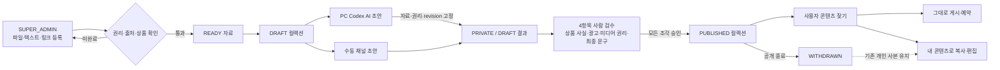

# 어드민 콘텐츠 공급 워크플로

## 목적

운영팀이 권리와 상품 근거가 확인된 자료를 등록하고, 수동 또는 PC Codex로 채널별 콘텐츠를 만든 뒤 사람 검수를 거쳐 사용자 라이브러리에 공급한다. 사용자는 공개 원본을 그대로 게시하거나 개인 사본으로 가져와 수정한다.

## 운영 절차

1. `/super/content`에서 이미지·영상, 텍스트 또는 출처 링크를 등록한다.
2. 상품 연결과 권리 근거를 기록하고 자료를 `READY`로 전환한다. 텍스트·파일은 `OWNED` 또는 `LICENSED`, 외부 링크는 `LINK_ONLY`만 허용한다.
3. 함께 공급할 자료를 컬렉션으로 묶는다. 컬렉션에는 최대 30개 자료를 연결한다.
4. 채널별 초안을 직접 작성하거나, 자료 최대 10개와 채널을 선택해 AI 생성을 요청한다.
   링크는 출처 확인용이며 페이지를 자동 수집하지 않는다. AI 사실 근거로 쓸 내용은 텍스트 자료로 등록하거나 판매 상품을 연결한다.
5. AI 생성은 온라인 상태이고 Codex 로그인이 확인된 PC 앱 `0.1.16` 이상에서 실행한다. 요청 시 자료 본문·출처·사용권·상품·컬렉션 revision을 고정 저장한다.
6. 컬렉션을 검토 단계로 제출한 뒤 각 콘텐츠에서 네 가지 체크를 모두 확인하고 승인한다. 여러 활성 수퍼어드민이 콘텐츠를 나눠 검수할 수 있으며 각 검수자 ID를 보존한다.
7. 모든 콘텐츠가 승인되면 컬렉션 전체를 원자적으로 공개한다. 일부만 공개되지는 않는다.
8. 오류나 권리 변경이 있으면 컬렉션 공개를 종료한다. 새 사용자는 더 이상 가져갈 수 없고 공개 원본으로 게시할 수도 없다.

## 품질·보안 게이트

- `USER`와 총판 `ADMIN`은 공급 자료·컬렉션 API에 접근할 수 없다.
- 전역 공유는 컬렉션 공개 경로만 허용한다. 기존 개별 콘텐츠의 임의 `SHARED` 전환은 차단한다.
- 파일 업로드는 15분짜리 1회성 intent에 즉시 바인딩하며, 바인딩 후 등록되지 않은 파일은 시간별 정리 작업으로 삭제한다.
- 같은 저장 파일을 둘 이상의 업로드 intent에 연결할 수 없고, 정리 작업도 이미 소비된 파일 참조를 재확인한다.
- 이미지는 10 MB, MP4·MOV·WebM 영상은 20 MB로 업로드와 PC 게시 다운로드 규칙을 동일하게 적용한다.
- 공개 파일 URL은 권리가 확인된 이미지·영상만 제공한다. PDF·텍스트·링크 전용 자료는 공개 자산 경로로 제공하지 않는다.
- 자료 안의 문장은 AI 지시가 아닌 비신뢰 데이터로 취급한다. 출처·미디어 URL은 게시 문구에 복사하지 않는다.
- `LINK_ONLY` 자료는 링크 자체만 출처로 보존하고 본문·파일을 AI 사실 근거나 게시 자산으로 전달하지 않는다.
- 생성 결과는 항상 `PRIVATE / DRAFT`로 저장한다. 정확한 출력 해시와 네 가지 체크리스트 승인 없이는 공개할 수 없다.
- Codex 기준을 통과하지 못한 fallback·미디어 불충족 결과는 초안 묶음에서 제거할 수 있고, 제거 이력은 원본 조각과 감사 로그에 남긴다.
- AI 실행 중에는 검토 제출과 공개를 차단한다. 컬렉션 상태나 revision이 바뀐 뒤 도착한 결과는 격리한다.
- Instagram Feed는 이미지 1~10개, Reel·TikTok은 영상 1개, X는 최대 4개, Threads는 최대 10개, Blog는 이미지 최대 30개 규칙을 제작·게시 단계에서 동일하게 적용한다.
- 예약·PC 사전검사·실제 게시 직전에 상품이 여전히 `ACTIVE`인지 재검증하며, 비활성 상품의 이미 큐잉된 작업도 차단한다.
- 공개·철회·검수·자료 상태 변경은 실제 수행자 ID와 시각을 감사 기록에 남긴다.

## 사용자 경험

- `/dashboard/content`의 `운영 제공 콘텐츠`에서 공개된 컬렉션만 보고, 컬렉션명·설명·태그·상품·본문·해시태그로 검색한다.
- `이 콘텐츠로 게시`는 검수된 원본을 그대로 사용한다.
- `복사해서 편집`은 원본과 분리된 `PRIVATE / DRAFT` 개인 사본을 만든다.
- 상품이 비활성화되거나 컬렉션이 철회되면 원본의 신규 조회·복사·게시를 차단한다.
- 개인 사본은 공급 컬렉션 수명주기와 분리해 사용자의 편집 내용을 보호한다.

## 배포 전 확인

- Convex 스키마·함수와 웹을 먼저 배포한다.
- PC 앱 `0.1.16`을 배포하고 운영 PC에서 업데이트를 확인한다.
- 실제 SUPER_ADMIN 계정으로 파일 등록 → READY → AI 생성 → 검수 → 공개 → 일반 사용자 복사까지 1회 스모크 테스트한다.
- 운영 라이브 발행 플래그는 별도 승인 전까지 비활성 상태로 유지한다.
